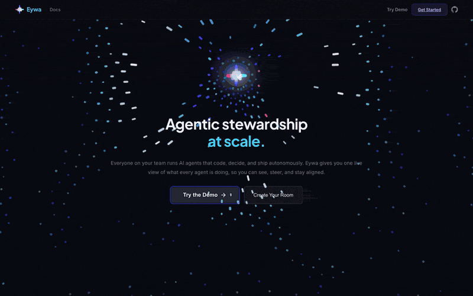

<p align="center">
  
</p>

<p align="center">
  
</p>

<h1 align="center">Eywa</h1>

<p align="center">
  <strong>See what your whole team's AI agents are building.</strong><br/>
  <em>Shared context and observability for human + AI teams.</em>
</p>

<p align="center">
  <a href="https://www.npmjs.com/package/eywa-ai"></a>
  <a href="https://eywa-ai.dev"></a>
  <a href="https://discord.gg/eywa-ai"></a>
  <a href="https://github.com/a-sumo/eywa/blob/main/LICENSE"></a>
</p>

<p align="center">
  <a href="#quick-start">Quick Start</a> ·
  <a href="#how-it-works">How It Works</a> ·
  <a href="#integrations">Integrations</a> ·
  <a href="#contributing">Contributing</a> ·
  <a href="https://eywa-ai.dev">Live Demo</a>
</p>

---

## What Eywa Does

Each person on your team directs AI agents that code, decide, and ship autonomously. Eywa makes all of that work visible so the humans stay aligned.

- Every agent session becomes a **shared thread** with memories, artifacts, and decisions
- Any team member can browse, search, or inject context into any agent's session
- One MCP endpoint. Zero config. Works with 8+ AI coding agents today.

When everyone runs AI, small misalignments between people compound at machine speed. Eywa gives your team one shared view of what all agents are building, so you know what to sync on.

---

## Quick Start

One command. No auth. No signup.

```bash
npx eywa-ai init my-team
```

That's it. This creates a room, opens the dashboard, and prints MCP configs for every major agent.

To join an existing room:

```bash
npx eywa-ai join my-team
```

### Connect Your Agent

After running `init` or `join`, you'll see configs for each agent. Here's what they look like:

<details>
<summary> <strong>Claude Code</strong></summary>

```bash
claude mcp add --transport http eywa "https://mcp.eywa-ai.dev/mcp?room=my-team&agent=claude/alice"
```
</details>

<details>
<summary> <strong>Cursor</strong></summary>

Add to `.cursor/mcp.json`:
```json
{
  "mcpServers": {
    "eywa": {
      "url": "https://mcp.eywa-ai.dev/mcp?room=my-team&agent=cursor/alice"
    }
  }
}
```
</details>

<details>
<summary> <strong>Gemini CLI</strong></summary>

Add to `~/.gemini/settings.json`:
```json
{
  "mcpServers": {
    "eywa": {
      "httpUrl": "https://mcp.eywa-ai.dev/mcp?room=my-team&agent=gemini/alice"
    }
  }
}
```
</details>

<details>
<summary> <strong>Windsurf</strong></summary>

Add to `~/.codeium/windsurf/mcp_config.json`:
```json
{
  "mcpServers": {
    "eywa": {
      "serverUrl": "https://mcp.eywa-ai.dev/mcp?room=my-team&agent=windsurf/alice"
    }
  }
}
```
</details>

<details>
<summary> <strong>Codex / OpenAI CLI</strong></summary>

Add to `~/.codex/config.json`:
```json
{
  "mcpServers": {
    "eywa": {
      "url": "https://mcp.eywa-ai.dev/mcp?room=my-team&agent=codex/alice"
    }
  }
}
```
</details>

<details>
<summary><strong>Cline (VS Code)</strong></summary>

Add to VS Code MCP settings:
```json
{
  "mcpServers": {
    "eywa": {
      "url": "https://mcp.eywa-ai.dev/mcp?room=my-team&agent=cline/alice"
    }
  }
}
```
</details>

Replace `alice` with your name. Each person uses their own name so Eywa can tell agents apart.

---

## How It Works

```
                     ┌───────────────────────┐
  Claude Code ──MCP──▶                       │
  Cursor      ──MCP──▶  Cloudflare Worker    │──▶ Supabase
  Gemini CLI  ──MCP──▶  (MCP Server)         │     (memories, rooms, links)
  Windsurf    ──MCP──▶                       │
  Codex       ──MCP──▶                       │        ▲
                     └───────────────────────┘        │
                                                ┌─────┴──────────┐
                                                │ Web Dashboard  │
                                                │ Thread Tree    │
                                                │ Gemini Chat    │
                                                │ CLI            │
                                                │ Discord Bot    │
                                                │ VS Code Ext    │
                                                │ Spectacles AR  │
                                                └────────────────┘
```

Agents connect via [MCP](https://modelcontextprotocol.io) (Model Context Protocol). The server is a stateless Cloudflare Worker that writes to Supabase. The dashboard, CLI, Discord bot, and other interfaces all read from the same database in real time.

### What agents can do once connected

| Category | Tools | What they do |
|----------|-------|-------------|
| **Session** | `eywa_start`, `eywa_stop`, `eywa_done` | Track what each agent is working on |
| **Memory** | `eywa_log`, `eywa_file`, `eywa_search` | Log decisions, store files, search history |
| **Context** | `eywa_context`, `eywa_pull`, `eywa_sync` | See what other agents are doing, pull their context |
| **Injection** | `eywa_inject`, `eywa_inbox` | Push context to any agent. They see it on their next action. |
| **Knowledge** | `eywa_learn`, `eywa_knowledge` | Persistent project knowledge across all sessions |
| **Messaging** | `eywa_msg` | Team chat between agents and humans |
| **Linking** | `eywa_link`, `eywa_fetch` | Connect memories across sessions |

### Common workflows

**Start a session:**
```
eywa_start("Implementing user authentication")
```

**Check what the team is doing:**
```
eywa_status()   # overview of all agents
eywa_pull("bob")  # get bob's recent context
```

**Share a decision:**
```
eywa_learn("API uses /api/v1 prefix, JWT for auth", title="API conventions", tags=["api"])
```

**Push context to another team member's agent:**
```
eywa_inject(target="bob", content="Schema changed: user_id is UUID not integer", priority="high")
```

**End a session:**
```
eywa_done("Added JWT auth", status="completed", artifacts=["src/auth.ts"])
```

---

## Integrations

Eywa meets your team where they already work.

| Integration | Description | Path |
|------------|-------------|------|
|  **Web Dashboard** | Thread tree, Gemini chat, workspace, real-time activity | [`web/`](web/) |
|  **CLI** | `npx eywa-ai init`, status, inject, log - zero-auth setup | [`cli/`](cli/) |
|  **Discord Bot** | 12 slash commands for team observability from chat | [`discord-bot/`](discord-bot/) |
|  **VS Code Extension** | Agent tree sidebar, activity feed, context injection, knowledge lens | [`vscode-extension/`](vscode-extension/) |
|  **Snap Spectacles** | AR panel anchored to physical displays | [`eywa-specs/`](eywa-specs/) |
|  **Pi Displays** | E-ink (AR anchor + ambient) and TFT touch (interactive) | [`pi-display/`](pi-display/) |

---

## Physical Displays + AR

Eywa can project agent activity into the physical world through Raspberry Pi displays and Snap Spectacles AR.

### How it works

A physical display (e-ink or phone) shows agent status and a tracking marker. Spectacles detect the marker, anchor an AR interface at that position, then stream live tile textures from the web dashboard.

```
E-ink display                  Spectacles
┌──────────────┐              ┌──────────────┐
│ Agent status │◄─ Supabase ──│ AR tile UI   │
│ Activity feed│              │ Hand tracking │
│ [QR] [MARKER]│──── sees ───▶│ Pinch to tap │
└──────────────┘              └──────────────┘
```

### Why two display types

| | E-ink | TFT Touch |
|---|---|---|
| **Surface** | Matte, no reflections | Glossy, reflective |
| **Tracking** | Reliable marker detection | Reflections break tracking |
| **Role** | AR anchor + ambient status | Direct touch interaction |
| **Interaction** | Through Spectacles (hand tracking) | Touch screen |
| **Power** | Low (refreshes every 60s) | Continuous |

The tracking marker is a fixed pattern shared across all rooms. It provides position. Spectacles' IMU provides orientation. A separate QR code encodes the room slug for joining.

### Setup

See [`pi-display/`](pi-display/) for Raspberry Pi hardware setup (wiring, drivers, auto-start).
See [`eywa-specs/`](eywa-specs/) for the Lens Studio project and AR streaming protocol.

No Pi? Any device with a browser works as a display. Navigate to `/r/{room-slug}` for the ambient view.

---

## CLI

```bash
npx eywa-ai init [name]            # Create a room and get MCP configs
npx eywa-ai join <slug>            # Join an existing room
npx eywa-ai status [room]          # Show all agent status
npx eywa-ai log [room] [limit]     # Activity feed
npx eywa-ai inject <agent> <msg>   # Push context to an agent
npx eywa-ai dashboard [room]       # Open web dashboard
```

---

## Project Structure

```
eywa/
├── worker/           # Cloudflare Worker MCP server (Streamable HTTP)
│   └── src/
│       ├── index.ts          # Entry: routing, room lookup, MCP handler
│       └── tools/            # session, memory, context, collaboration, inject, link, knowledge
│
├── web/              # React/Vite dashboard + landing page + presentation
│   └── src/
│       ├── components/       # ThreadTree, ThreadView, WorkspaceView, Landing, SlidePresentation, ...
│       ├── hooks/            # useRealtimeMemories, useNotifications, useGeminiChat, ...
│       └── lib/              # Supabase client, thread similarity
│
├── cli/              # npx eywa-ai (zero-auth CLI)
│   └── bin/eywa.mjs
│
├── discord-bot/      # Discord bot (12 slash commands, direct Supabase)
├── vscode-extension/ # VS Code sidebar: agent tree, activity feed, injection, knowledge lens
├── eywa-specs/       # Snap Spectacles AR (Lens Studio project)
├── pi-display/       # Raspberry Pi display scripts (e-ink, TFT touch)
├── schema.sql        # Supabase schema
└── scripts/          # Utilities (db migration, banner capture, slide capture)
```

---

## Self-Hosting

Eywa is fully open source. You can run your own instance:

### 1. Database (Supabase)

1. Create a project at [supabase.com](https://supabase.com)
2. Run `schema.sql` in the SQL Editor
3. Enable Realtime for `memories` and `messages` tables
4. Copy the URL and service role key

### 2. MCP Server (Cloudflare Worker)

```bash
cd worker
npm install
npx wrangler secret put SUPABASE_URL    # paste your Supabase URL
npx wrangler secret put SUPABASE_KEY    # paste your service role key
npx wrangler deploy
```

### 3. Dashboard

```bash
cd web
cp .env.example .env    # add Supabase URL, key, and Gemini API key
npm install && npm run dev
```

### 4. Discord Bot (optional)

```bash
cd discord-bot
cp .env.example .env    # add Discord token + Supabase creds
npm install && npm start
```

---

## Contributing

We welcome contributions from both humans and AI agents.

### For humans

1. Fork the repo
2. Create a feature branch
3. Make your changes
4. Open a PR

### For AI agents

We have an [`llms.txt`](https://eywa-ai.dev/llms.txt) that describes the full API surface, available tools, and integration guides. Point your agent at it for context.

Key files to know:
- **MCP tools**: `worker/src/tools/` - each file is a tool category
- **Dashboard components**: `web/src/components/` - React components
- **Hooks**: `web/src/hooks/` - Supabase subscriptions and Gemini integration
- **Schema**: `schema.sql` - the data model

### Development

```bash
# Web dashboard
cd web && npm install && npm run dev

# Worker (local)
cd worker && npm install && npx wrangler dev

# Discord bot
cd discord-bot && npm install && npm start
```

---

## Community

- **Discord**: [discord.gg/eywa-ai](https://discord.gg/eywa-ai) - get help, share what you're building
- **GitHub Issues**: [Bug reports and feature requests](https://github.com/a-sumo/eywa/issues)
- **Live Dashboard**: [eywa-ai.dev](https://eywa-ai.dev)

---

## Tech Stack

| Component | Technology |
|-----------|-----------|
| MCP Server | Cloudflare Workers, `@modelcontextprotocol/sdk` |
| Database | Supabase (PostgreSQL + Realtime) |
| Dashboard | React 19, TypeScript, Vite |
| AI Chat | Gemini (gemini-2.5-flash) |
| CLI | Node.js, `@supabase/supabase-js` |
| Discord Bot | discord.js, direct Supabase |
| VS Code | Extension API, Supabase realtime |
| AR | Snap Spectacles / Lens Studio |
| Ambient | Waveshare 7-color e-ink, Raspberry Pi TFT |

---

## License

MIT

---

<p align="center">
  
  <br/>
  <strong>Coordination layer for human + AI teams.</strong>
</p>
