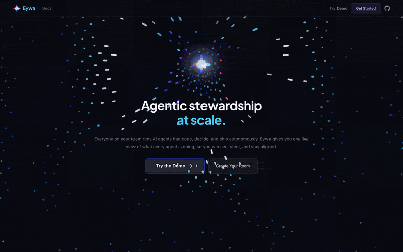
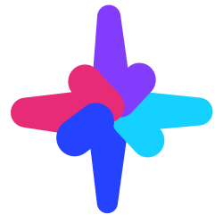

<!-- This documentation was tested from Spectacles voice agent -->

  

  

<h1 align="center">Eywa</h1>

  <strong>Stop your AI agents from stomping on each other.</strong> 
  <em>Shared memory and coordination for teams running multiple coding agents.</em>

  
  
  
  

  <strong>Gemini 3 Hackathon submission (Feb 10, 2026)</strong> 
  <a href="https://eywa-hackathon.vercel.app/r/demo-71wb">Live snapshot</a> &middot;
  <a href="https://github.com/a-sumo/eywa/tree/060a6dc">Source at submission (060a6dc)</a> &middot;
  <a href="#submission-integrity">Submission integrity</a>

  
  
  
  
  

  <a href="#quick-start">Quick Start</a> ·
  <a href="#how-it-works">How It Works</a> ·
  <a href="#integrations">Integrations</a> ·
  <a href="#contributing">Contributing</a> ·
  <a href="https://eywa-ai.dev">Live Demo</a>

---

## What Eywa Does

Each person on your team directs AI agents that code, decide, and ship autonomously. Eywa makes all of that work visible so the humans stay aligned.

- **Destination tracking** - set a target state for the team, define milestones, and watch progress as agents ship
- **Live agent map** - see what every agent is working on, what systems they're touching, and their completion percentage
- **Context injection** - push decisions or corrections into any agent mid-session with automatic piggyback delivery
- **Team knowledge** - persistent memory that survives across sessions for architecture decisions, conventions, and patterns
- **Context recovery** - agents checkpoint their progress and send distress signals when context runs low, so new sessions pick up where old ones left off
- **Work claiming** - agents declare what they're working on to prevent duplicate effort across the team
- **Timeline branching** - git-like version control for agent work with rewind, fork, merge, and cherry-pick
- **Global insights network** - publish anonymized patterns from your fold and query what worked in other teams
- **Gemini steering** - built-in AI chat panel for querying agent status, detecting patterns, and steering the team
- **Host telemetry** - agents report their phase (working/thinking/compacting), token usage, and sub-agent count so you always know what's happening inside a session
- **Silence detection** - active agents that go quiet get flagged automatically across all surfaces (10m/30m/60m thresholds)
- One MCP endpoint. Zero config. Works with 8+ AI coding agents today.

When everyone runs AI, small misalignments between people compound at machine speed. E
...[truncated]...
se-js` |
| Discord Bot | discord.js, direct Supabase |
| VS Code | Extension API, Supabase realtime |
| AR | Snap Spectacles / Lens Studio |
| Ambient | Waveshare 7-color e-ink, Raspberry Pi TFT |

---

## Submission Integrity

This section documents what is verifiably timestamped versus what was regenerated for demonstration purposes.

**Verified components**

| Component | Verification | Timestamp |
|-----------|-------------|-----------|
| Web + Worker code | Git commit [`060a6dc`](https://github.com/a-sumo/eywa/tree/060a6dc) | Feb 10, 2026 |
| Guild Navigator | Git commit `1f0f58f` | Feb 10, 2026 |
| npm package | [`eywa-ai@0.3.1`](https://www.npmjs.com/package/eywa-ai) registry entry | Feb 10, 13:43 UTC |
| MCP Server | Cloudflare Worker, 45 MCP tools | Live since Feb 6 |
| Spatial mapping API | Guild Navigator on Railway | Live since Feb 8 |

**Data snapshot**

The frozen deployment at [eywa-hackathon.vercel.app](https://eywa-hackathon.vercel.app/r/demo-71wb) serves fold data from a static JSON snapshot rather than live database records. The original demo fold was deleted during a post-submission database migration that renamed tables. We regenerated sample data to illustrate how the system works.

The `eywa-dev` fold contains 586 real memories from Feb 12-14 where AI agents used Eywa to coordinate building Eywa itself. This is genuine production usage but occurred after the submission deadline. All data snapshots are in [`snapshots/`](snapshots/) for inspection, along with a full [audit document](snapshots/AUDIT.md).

The submission is the code and architecture. The fold structure, coordination protocol, and cross-agent context retrieval are what we built during the hackathon. The specific memories in any given fold are interchangeable demonstrations of that system.

---

## License

Apache 2.0

---

  
   
  <strong>Coordination layer for human + AI teams.</strong>

